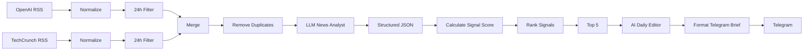

# Product Signal

> **Know what matters. Skip the noise.**

Product Signal is an AI-powered news intelligence pipeline designed for Product, AI, Technology, and Business professionals.

Instead of simply collecting news, Product Signal evaluates each article based on **relevance, potential impact, novelty, and actionability**, converts those signals into a normalized score, ranks the most important stories, and generates a concise daily intelligence brief.

The goal is simple:

**Turn information overload into a small set of actionable signals.**

---

## What is Product Signal?

Every day, professionals are exposed to hundreds of product launches, AI developments, technology announcements, startup news, business events, and market changes.

The problem is not lack of information.

The problem is **knowing what actually matters**.

Product Signal is an experiment in building an AI-powered information filtering layer between raw news and professional decision-making.

Instead of asking:

> "What happened today?"

Product Signal asks:

> **"What happened, how important is it, and why should I care?"**

---

## The Problem

Traditional news aggregation systems optimize for **collection and delivery**.

They answer:

- What was published?
- Where was it published?
- When was it published?

Product Signal adds another layer:

- Is this relevant to a Product/Business/Technology professional?
- How significant could it be?
- Is it genuinely novel?
- Is there something a professional can learn from or act on?
- What is the practical product takeaway?

This creates a pipeline from:

```text
Raw News
   ↓
Relevant News
   ↓
AI Analysis
   ↓
Signal Scoring
   ↓
Ranking
   ↓
Top Signals
   ↓
Daily Intelligence Brief
```

---

## Current Scope

The current implementation is an MVP focused on two RSS sources:

- OpenAI News
- TechCrunch

The pipeline processes articles published within the previous **24 hours**, removes duplicate URLs, evaluates each article using an LLM, ranks the resulting signals, selects the top five, and generates a daily brief delivered through Telegram.

### Current Pipeline

```text
OpenAI RSS ───────┐
                  ├── Normalize ── Filter ──┐
TechCrunch RSS ───┘                         │
                                            ↓
                                      Merge Sources
                                            ↓
                                      Remove Duplicates
                                            ↓
                                      AI News Analysis
                                            ↓
                                      Signal Scoring
                                            ↓
                                      Rank Signals
                                            ↓
                                      Select Top 5
                                            ↓
                                      AI Daily Editor
                                            ↓
                                      Format Brief
                                            ↓
                                      Telegram
```

---

## How It Works

### 1. Collect

The workflow collects news from RSS feeds.

Current sources:

| Source | Feed |
|---|---|
| OpenAI | OpenAI News RSS |
| TechCrunch | TechCrunch RSS |

The workflow can be extended with additional RSS-compatible sources.

---

### 2. Normalize

Each article is transformed into a common structure:

```json
{
  "title": "...",
  "url": "...",
  "source": "...",
  "published_at": "...",
  "content": "..."
}
```

This creates a consistent input format regardless of the original source.

---

### 3. Time Filtering

Only articles published within the previous **24 hours** are passed to the analysis stage.

This prevents the daily pipeline from repeatedly processing older articles.

---

### 4. Deduplication

Articles are deduplicated using their URL.

This prevents the same article from being evaluated multiple times when it appears across the collected sources.

---

## AI News Analysis

Each article is evaluated by an LLM using four scoring dimensions.

### Relevance

How relevant is the article to a Product, Business, or Technology professional?

**0 → 4**

### Impact

How significant could the news be for a business, product, technology, or market?

**0 → 4**

### Novelty

How new or significant is the information?

**0 → 4**

### Actionability

Can a professional learn from, react to, or act on the information?

**0 → 4**

The model also produces two qualitative insights:

### Why It Matters

A concise explanation of why the news deserves attention.

### Product Takeaway

A practical takeaway specifically framed for a Product Manager or Product professional.

---

## Structured AI Output

The article analysis is constrained to a structured JSON format:

```json
{
  "category": "AI",
  "relevance": 3,
  "impact": 4,
  "novelty": 3,
  "actionability": 4,
  "why_it_matters": "The development may affect how AI products are built and adopted.",
  "product_takeaway": "Product teams should evaluate the implications for their AI workflows."
}
```

The supported categories are:

```text
Product
AI
Technology
Business
Startup
Strategy
Other
```

Using structured output makes the downstream scoring and ranking deterministic and easier to extend.

---

# Signal Scoring

Product Signal converts the four AI-generated dimensions into a single normalized score.

Each dimension has a maximum score of 4:

```text
Relevance       0–4
Impact          0–4
Novelty         0–4
Actionability   0–4
--------------------
Maximum         16
```

The normalized signal score is calculated as:

```text
Signal Score =
(Relevance + Impact + Novelty + Actionability)
------------------------------------------------ × 10
                         16
```

This produces a score between:

```text
0 → 10
```

### Signal Levels

The current implementation maps the score into three levels:

| Score | Signal Level |
|---:|---|
| 8–10 | Must Know |
| 6–7.99 | Worth Knowing |
| < 6 | Noise |

These thresholds are part of the current MVP and can be tuned as more evaluation data becomes available.

---

# Ranking

After scoring, all analyzed articles are sorted by:

```text
Signal Score ↓
```

The pipeline then selects the **Top 5 Signals**.

This creates a deliberate information bottleneck:

> Instead of delivering everything the system finds, Product Signal surfaces a small number of signals worth attention.

---

# AI Daily Editor

The selected top five signals are passed to a second LLM stage acting as the **AI Editor**.

The editor transforms the structured signals into a concise daily intelligence brief.

For each story, the brief contains:

- Short headline
- Source
- What happened
- Why it matters
- Product takeaway
- Signal score

The editor also identifies:

### Today's Pattern

A short synthesis of the common theme or important pattern across the selected stories.

This moves the product beyond simple summarization toward **cross-story synthesis**.

---

# Telegram Delivery

The generated daily brief is formatted specifically for Telegram and delivered through a Telegram bot.

The output is structured around:

```text
🧠 PRODUCT SIGNAL
Daily Intelligence Brief

📌 Source
📰 What happened
🎯 Why it matters
💡 Product takeaway
📊 Signal score

━━━━━━━━━━━━━━━━━━

📊 TODAY'S PATTERN
...
```

The current workflow is configured to run automatically on a daily schedule.

---

# Architecture



---

# Product Logic

The core product loop is:

```text
Collect
  ↓
Filter
  ↓
Understand
  ↓
Score
  ↓
Rank
  ↓
Synthesize
  ↓
Deliver
```

This distinction is important.

Product Signal is not intended to be another RSS reader.

The product value is created in the layers between **collection and delivery**.

---

# Why the Scoring Model?

A simple chronological feed assumes:

> Newer = more important.

Product Signal uses a different assumption:

> **Importance is multidimensional.**

A story can be highly relevant but have low novelty.

Another story can be highly novel but have limited practical impact.

Another can have significant business impact but be irrelevant to a Product professional.

By separating these dimensions, the system can make its prioritization logic explicit and tunable.

---

# Technology Stack

### Automation

- n8n
- RSS feeds
- Scheduled workflows

### AI

- OpenAI
- GPT-5.4-mini
- Structured LLM output

### Delivery

- Telegram Bot

### Development

- Docker
- Docker Compose
- Git
- GitHub

---

# Repository Structure

```text
product_signal/
│
├── workflows/
│   └── news-pipeline.json
│
├── prompts/
│
├── docs/
│
├── examples/
│
├── .gitignore
├── docker-compose.yml
└── README.md
```

The repository is intentionally structured so that the workflow, prompts, documentation, and example outputs can evolve independently.

---

# Getting Started

## Prerequisites

You need:

- Docker Desktop
- Docker Compose
- An n8n instance
- An OpenAI API credential
- A Telegram Bot credential

---

## 1. Clone the Repository

```bash
git clone https://github.com/mjy976/product-signal.git
cd product-signal
```

---

## 2. Start n8n

The repository includes a Docker Compose configuration for running n8n locally.

```bash
docker compose up -d
```

Then open:

```text
http://localhost:5678
```

---

## 3. Import the Workflow

In n8n:

```text
Workflows
→ Import from File
→ workflows/news-pipeline.json
```

---

## 4. Configure Credentials

The exported workflow references credentials for:

- OpenAI
- Telegram

These credentials are **not included in this repository**.

Create your own credentials in n8n and map them to the corresponding nodes.

---

## 5. Configure Telegram

The Telegram delivery node should be configured with your own:

- Telegram Bot credential
- Target chat/channel ID

Do not commit bot tokens or other secrets to Git.

---

## 6. Test the Workflow

The workflow contains both:

- A scheduled trigger
- A manual execution trigger

The current exported workflow is primarily connected to the scheduled pipeline. For development and testing, you can execute the workflow manually from n8n after configuring the required credentials.

---

# Security

Secrets should remain outside the repository.

Do not commit:

```text
API keys
Bot tokens
Passwords
OAuth credentials
Environment secrets
Private credentials
```

The exported workflow contains credential references, but credentials themselves must be configured locally in n8n.

For production deployments, credentials should be managed through the appropriate n8n credential and environment configuration mechanisms.

---

# Current Limitations

This repository represents an **MVP**, not a finished production-grade news intelligence platform.

Current limitations include:

### Limited Source Coverage

The current implementation uses two RSS sources.

Additional sources can be added as the ingestion layer evolves.

### LLM-Based Evaluation

Signal scores are generated by an LLM.

This means scoring can contain subjectivity and model variance.

A future version should evaluate scoring consistency using a labeled benchmark set.

### No Historical Signal Memory

The current workflow does not maintain a persistent database of previously analyzed signals.

A future version can introduce historical memory to support:

- Long-term trend detection
- Recurring-topic detection
- Historical comparisons
- Improved novelty estimation

### Basic Deduplication

Deduplication currently uses the article URL.

Semantic or content-based deduplication could identify syndicated or substantially similar articles published under different URLs.

### Fixed Top-K Selection

The current pipeline always selects five signals.

A future version could dynamically determine the number of signals based on signal quality and distribution.

---

# Roadmap

## Phase 1 — MVP

- [x] RSS ingestion
- [x] Multi-source normalization
- [x] 24-hour filtering
- [x] URL-based deduplication
- [x] LLM article analysis
- [x] Structured output
- [x] Signal scoring
- [x] Signal ranking
- [x] Top-5 selection
- [x] AI-generated daily brief
- [x] Telegram delivery

## Phase 2 — Intelligence Layer

- [ ] More news sources
- [ ] Semantic deduplication
- [ ] Topic clustering
- [ ] Historical signal memory
- [ ] Trend detection
- [ ] Improved novelty scoring
- [ ] Source reliability signals
- [ ] Evaluation dataset for LLM scoring

## Phase 3 — Personalization

- [ ] User-specific interests
- [ ] Role-based relevance
- [ ] Custom scoring weights
- [ ] Personalized daily brief
- [ ] Feedback loop
- [ ] "More like this" / "Less like this" signals

## Phase 4 — Decision Intelligence

- [ ] Weekly intelligence summaries
- [ ] Emerging trend detection
- [ ] Cross-source synthesis
- [ ] Competitive intelligence
- [ ] Product opportunity detection
- [ ] Strategic implications
- [ ] Alerting for high-impact signals

---

# Product Metrics to Explore

As the product evolves, the most important question is not:

> "How many articles did we process?"

It is:

> **"How effectively did we reduce information overload?"**

Potential product metrics include:

### Signal Precision

Percentage of surfaced stories that users consider genuinely valuable.

### Signal Coverage

Percentage of important events that the system successfully surfaces.

### Noise Rate

Percentage of delivered stories users consider irrelevant or low-value.

### Brief Engagement

How frequently users read or interact with the daily brief.

### Actionability

Percentage of surfaced signals that lead to a meaningful follow-up, investigation, or decision.

### User Feedback

Explicit feedback can eventually be used to calibrate relevance and ranking.

---

# Design Principles

Product Signal is built around several principles.

### 1. Signal Over Volume

More news is not necessarily more value.

### 2. Explain the Ranking

A signal should not only be ranked; the system should provide a reason for its importance.

### 3. Separate Analysis from Presentation

The pipeline first creates structured intelligence and then generates the human-readable brief.

### 4. Keep the Decision Layer Visible

The scoring model is explicit rather than hidden entirely inside a generative response.

### 5. Optimize for Professional Attention

The scarce resource is not information.

It is **attention**.

---

# Why I Built This

Product Signal started from a simple observation:

Professionals working in Product, AI, Technology, and Business increasingly face an information overload problem.

There are more sources, more announcements, more AI developments, and more content than any individual can reasonably process.

The interesting product question is therefore not:

> "How can we collect more information?"

It is:

> **"How can an AI system help a professional decide what deserves attention?"**

Product Signal is an exploration of that question.

It combines:

- Product thinking
- AI-assisted analysis
- Information filtering
- Workflow automation
- Structured decision logic
- LLM-based synthesis

The project is intentionally being developed incrementally, with the MVP serving as the foundation for a more advanced **AI News Intelligence Agent**.

---

# Status

**MVP — Active Development**

The current implementation is functional as an n8n workflow and is being developed toward a more robust AI-powered information intelligence product.

---

# Author

**Mohammadjavad Yajadda**

Product / Business Analysis · AI · Automation

GitHub: [@mjy976](https://github.com/mjy976)

---

## License

This project is currently provided as a portfolio and learning project.

License terms may be added as the project evolves.